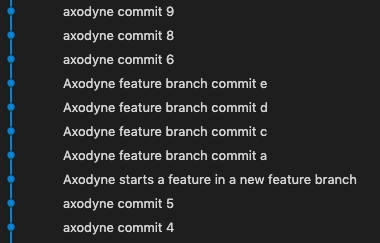

# Basic merging with topics and features

For the solo developer, it can make sense to have a single branch called ```master``` or ```main``` and just commit work to that. This is not terribly safe and can cause trouble when some new feature is added. It would be nice to be able to work on that feature safe in the knowledge that the existing work is secure from these developmental activities.

Git lets (encourages) you create branches whenever needed - specifically for this kind of purpose. You create a branch, do work there and then bring the changes into your main branch when they are ready. Or you just throw the branch away if it does not pan out. Regardless, you can switch back to the original ```main``` branch at any time and return to development work later.

Suppose axodyne has a repo:

1. The original, canonical github repository is maintained by the Axodyne account. Only Axodyne is able to write changes to this account.

2. Axodyne works away on the repo. Changes are made, commits are added.

3. In the early days, changes are made directly into the ```main``` branch and pushed up to the github repo as needed.

4. Normally, a meaningful commit message would be used but in this early state, the messages are numbered to correspond with these paragraph numbers.

5. The result is a nice, simple linear sequence of commits that everyone can follow.

## Feature by Axodyne

a. Now Axodyne decides to add a new feature and creates a feature branch for the work. This is the first commit after creating the feature branch.

b. The feature branch allows axodyne to work on the feature without affecting the main branch of the repo.

c. At any time, axodyne could switch back to ```main```. to use the original repository. The only proviso is that all the work on the feature branch is committed before switching branches.

d. When axodyne is happy with the state of the new feature, it can be joined back with the main branch. It is a good idea to do a bit of a tidy before then to make sure everything is as it should be.

e. there are a couple of ways to join the work together and incorporate the new feature. The one used for this feature is a ***merge***

6. To do the merge, azodyne makes sure all feaure changes are committed and then switches to the ```main``` branch with ```git checkout main```. Next, she will use the command ```git merge feature``` and the changes in feature will incorporated into the ```main``` branch. Assume for now there are no conflicts.

7. Once the feature is finished with, the feature branch can be deleted.

8. The command for this is ```git branch -d feature```

9. Looking at the record of commits in a simple case like this will probably show little or no evidence of the existence of the feature branch. The reason frthis is that the ```main``` branch did not change while ```feature``` was being worked on so the merge was just a question of adding the changes to the list and moving up the HEAd. This is a fast-forward merge.

10. Now that the changes are all checked and stable, and the feature is incorporated into ```main```, the repo can be push back up to github for publication or release. Some people like to retain all the commit messages, others like to squash them down for a more compact look. This example will keep al the messages for clarity. Whatever you choose, you cannot easily change your mind after pushing to github.

Looking at the log graph, the feature branch has fitted seamlessly into the main branch and development looks like one continuous set of commits.


