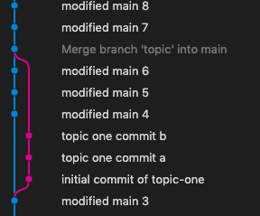

# Merging with a Modified Main Branch

It is pretty clean and simple when a repo maintainer is working on a single ```main``` branch and wants to just add commits.

Even if feature or topic branches are involved, this remains simple so long as the main branch is not modified while the feature or topic is being worked on.

What happens if ```main``` is modified while a topic is being worked on?

Suppose axodyne, the repo owner/maintainer, is working away on ```main```:

1. Things can proceed as before. Changes are made and committed.

2. Slowly, it dawns on our maintainer that a new topic is needed.

3. She creates a new ```topic``` branch immediately after committing this change to ```main```.

4. Having worked a little on the topic document, axodyne pauses. She makes sure the latest ```topic``` changes are committed and the checks out ```main``` to return at this point and make some changes in the ```main``` branch.

5. These changes are in a different document to those made in the ```topic``` branch and so there are unlikely to be any conflicts.

6. Thus, axodyne ploughs on in ```main``` without any worries. After a while, it  comes time to bring in the topic and merge it with main. At that time, the most recent change in ```main``` is committed and she is ready for the merge. Since the ```main``` branch is the one that is currently active, it should be safe to simply commit this change and then run ```git merge topic```.

7. When the ```topic``` branch is merged, git cannot simply fast forward the changes on top of the existing ```main``` branch because ```main``` has changed since ```topic``` was created. Instead, a merge commit is created. It should be visible in the history immediately before the commit for this update.

8. The default message associated with the merge commit will be pretty self-explanatory and will say something like ```Merge branch 'topic' into main```.

9. Once the topic has been successfully merged, its branch is typically not needed any more and can be deleted (```git branch -d topic```). After that, if everything is OK, it is probably time to push the ```main`` branch up to github

After the merge of the topic, a graph of the commits might look like this:




