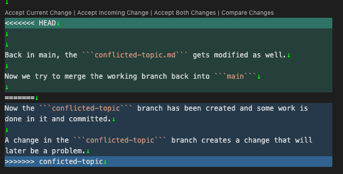
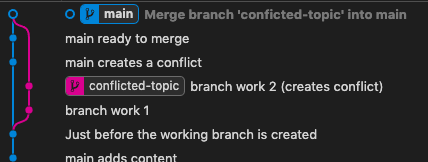

# Merging with conflicts

Happy now with basic development, axodyne knows how to make changes to the ```main``` branch and commit them. She is also persuaded that it is better create working branches for development, make the changes there and then merge them in to ```main`` when ready - even if main has changed in the meantime.

There may come a time when changes are made to files in both ```main``` and a working branch - call it ```develop``` for now. Why and how, this can happen is not so important. For now, concentrate on what t do about it when it does happen. Suppose a new file is needed - call it ```conflicted-topic.md```. The file is created, some content added and the ```main``` branch committed and brought up to date.

After some content is added to the new file, axodyne creates a branch to continue work with it.

Now the ```conflicted-topic``` branch has been created and some work is done in it and committed.

A change in the ```conflicted-topic``` branch creates a change that will later be a problem.

Back in main, the ```conflicted-topic.md``` gets modified as well.

Now we try to merge the working branch back into ```main```

The conflicts are shown like this:



and axodyne must try to resolve them. The section marked 'HEAD' is from the current branch, the other section comes from the branch we are trying to merge. Remove the markers and edit the files to resolve the conflicts.

Once the conflicts have been resolved, the files can be re-staged and the merge commit completed.

Once merged, there will be no indication that there was a problem and the merge will look like any other:



Tidy up by deleting the working branch if it is finished with and then puch to github for a permanent update.
