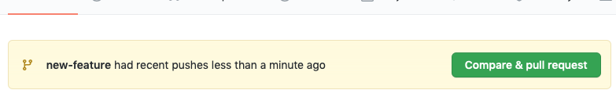
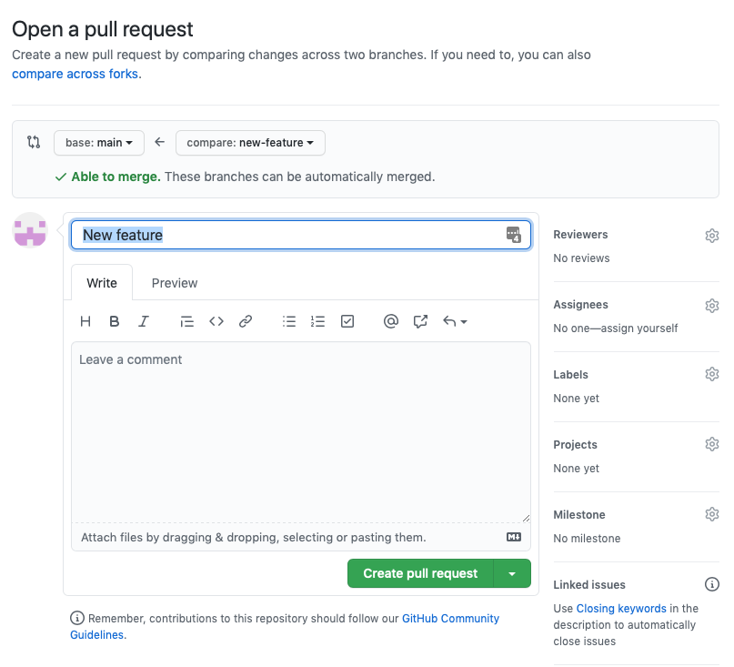
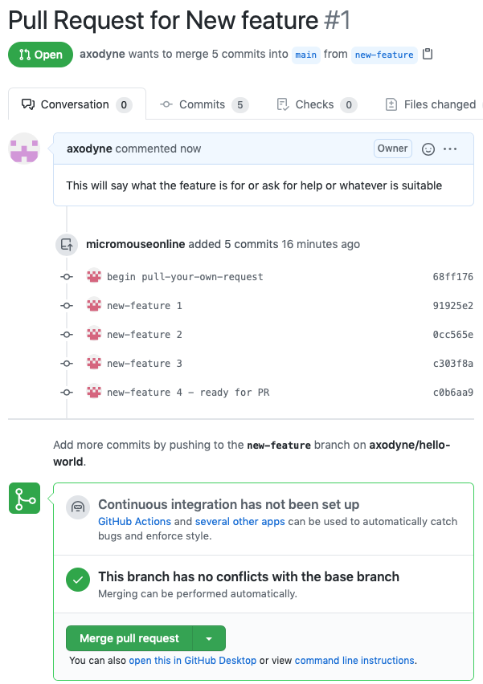

# Pull Requests to your own repository

Pull requests are often associated with work on some other repository to which you want to contribute. Somtimes, you might want to create a pull request to your own repository. Sometimes that is just because you want a review of the change by some other person. Your repository may also have write access by several people and you want a more formal process for making changes that are agreed by everyone on the team, or just the team lead or leaders.

As with any development, it is best to create a branch for te work. Here, axodyne creates a branch called ```new-feature`` and commits some work to it.

While work it going on elsewhere, the new feature gets some love and is eventually ready for the Pull Request. If your main repository is on github, all you need to do is push the new branch up and github will let you create a pull request on their website. This is the easiest and safest way to manage stuff. Github does al the donkey work and provides a place for discussions and reviews.

The feature branch is ready so it is now pushed up with the command.

    git push -u origin new-feature

The ```-u``` flag tels git on your ocal computer to track the remote branch for ease of access later. You only need that the first time the branch is pushed.

Github notices the new branch and shows this at the top of the repository page:



Click the _compare & pull request_ button to see this:



Notice that, at the top, it shows that you are comparing the ```main``` branch with the ```new-feature``` that you just pushed. Leave these alone for now as they represent the sensible defaults.

You can give the pull request a title ad description as suits your needs.

Then click the _Create Pull Request_ button.

Once that is none, github opens the pull request page. the top of which looks like this:



Here you will see the commits that form part of the ```new-feature``` branch and, if there are no conflicts, the option to just merge the pull request. It is also possible, further down the page, to add comments and request further changes.

Before merging this feature, note that the author can add new commits to te brach and push them up at any point before they are merged so changes or additions are possible and encouraged.

When all is ready, merge the request. You will be asked for confirmation and then asked if you want to delete the branch. Do that because it is now finished with.

